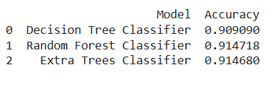

# Malicious URL Detection Using Machine Learning

## Overview  
This project aims to detect malicious URLs to prevent cybersecurity threats like phishing, malware, and defacement. Using machine learning models, it classifies URLs as malicious or benign with high accuracy.

---

## Dataset  
The dataset consists of 651,191 URLs, categorized as:  
- **Benign (Safe)**: 428,103  
- **Defacement**: 96,457  
- **Phishing**: 94,111  
- **Malware**: 32,520
  

**Sources:**  
- [Malicious URLs dataset](https://www.kaggle.com/datasets/sid321axn/malicious-urls-dataset)  
---

## Key Features  
- **Feature Extraction**: Analysis of URL characteristics such as length, paths, special characters, and tokenized components.
- **Models Implemented**:  
  - Decision Tree Classifier  
  - Random Forest Classifier  
  - Extra Trees Classifier  

---

## Results

## Steps to Reproduce  
1. Clone the repository
2. Download the dataset from kaggle
3. Run the code on colab

